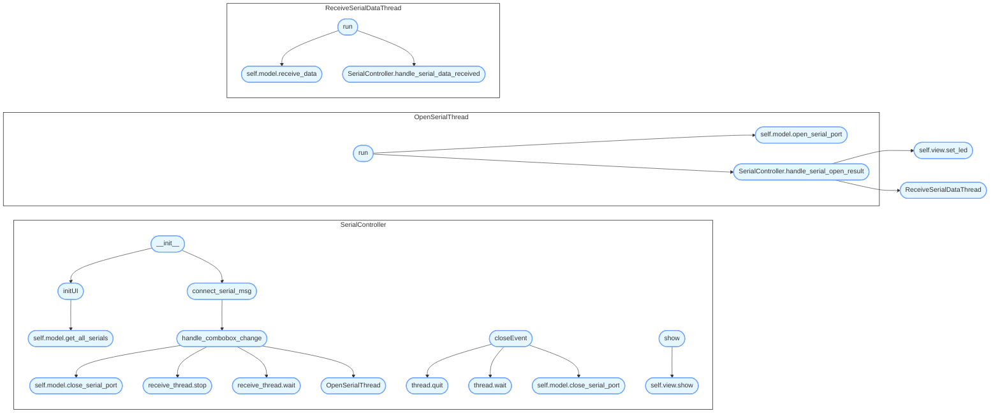

```mermaid
graph LR
    classDef process fill:#E5F6FF,stroke:#73A6FF,stroke-width:2px;

    subgraph SerialController
        style SerialController fill:#ffffff,stroke:#000000,stroke-width:1px
        SCInit([__init__]):::process --> SCInitUI([initUI]):::process
        SCInit --> SCConnectMsg([connect_serial_msg]):::process
        SCInitUI --> ModelGetAllSerials([self.model.get_all_serials]):::process
        SCConnectMsg --> SCHandleChange([handle_combobox_change]):::process
        SCHandleChange --> ModelCloseSerialPort1([self.model.close_serial_port]):::process
        SCHandleChange --> ReceiveThreadStop1([receive_thread.stop]):::process
        SCHandleChange --> ReceiveThreadWait1([receive_thread.wait]):::process
        SCHandleChange --> OpenSerialThreadInit([OpenSerialThread]):::process
        SCCloseEvent([closeEvent]):::process --> ThreadQuit([thread.quit]):::process
        SCCloseEvent --> ThreadWait([thread.wait]):::process
        SCCloseEvent --> ModelCloseSerialPortAll([self.model.close_serial_port]):::process
        SCShow([show]):::process --> ViewShow([self.view.show]):::process
    end

    subgraph OpenSerialThread
        style OpenSerialThread fill:#ffffff,stroke:#000000,stroke-width:1px
        OpenSerialThreadRun([run]):::process --> ModelOpenSerialPort([self.model.open_serial_port]):::process
        OpenSerialThreadRun --> SCHandleResult([SerialController.handle_serial_open_result]):::process
    end

    subgraph ReceiveSerialDataThread
        style ReceiveSerialDataThread fill:#ffffff,stroke:#000000,stroke-width:1px
        ReceiveSerialDataThreadRun([run]):::process --> ModelReceiveData([self.model.receive_data]):::process
        ReceiveSerialDataThreadRun --> SCHandleData([SerialController.handle_serial_data_received]):::process
    end

    SCHandleResult --> ViewSetLED([self.view.set_led]):::process
    SCHandleResult --> ReceiveSerialDataThreadInit([ReceiveSerialDataThread]):::process
```
